# 第五次作业

### 自动化少61 何奈特 2140506114

---

## 题目1

> 频域低通滤波器：设计低通滤波器包括 butterworth and Gaussian，选择合适的半径，计算功率谱比，平滑测试图像test1和2

* 对位图格式pgm和tif，沿用上次的处理，详见[bitmap.cpp](bitmap.cpp)（注：上次作业中的PGM5类存在一个bug，读入的长的宽顺序反了，碰巧后面又误把宽写作高，对矩形图像test3.pgm会出现一行瑕疵，现已修复）。此外将一些常用文件名操作（例如添加后缀）加入了Bitmap类中，另改变了bmp的写文件操作，可以更方便地输出中心搬移过的频谱图。

* 读入一幅M*N的图像后，至少要补零至2M*2N，这是为了避免wraparound错误；另外为了方便实现FFT算法，需要补到2的整数次幂，综上输入图像应该补零至P*P，P=2^(ceil(lb(max(M, N))))。对此进行二维DFT得到复频谱，与滤波器的频谱逐点相乘，再进行逆DFT（就是对频谱再进行一次DFT，做中心对称，然后逐点除以P^2），依原图范围裁剪得到处理后图像。详见[filter.cpp](filter.cpp)

* 这里使用最简单的方式计算二维DFT：先对每一行计算FFT，再对每一列计算FFT，复杂度n*n*log(n)，对于大图像的处理稍慢，这点不可避免。代码见[fft.cpp](fft.cpp)

* 功率谱定义为圆内频点模平方的求和，这部分内容写在[ps.cpp](ps.cpp)中，生成了几幅功率谱分布图（横轴是频率，纵轴是功率谱密度），以及功率谱比表[test1_ps.csv](test1_ps.csv)、[test2_ps.csv](test2_ps.csv)、[test3_ps.csv](test3_ps.csv)、[test4_ps.csv](test4_ps.csv)：

图像|功率谱图
--|--
|
|
|
|

功率谱比|test1|test2|test3|test4
--|--|--|--|--
10|0.880412|0.926615|0.842839|0.905507
20|0.940086|0.957706|0.922725|0.948356
25|0.954613|0.965337|0.932647|0.959681
50|0.980629|0.981445|0.978356|0.982474
100|0.993942|0.989779|0.996205|0.993447

* butterworth的公式为1/(1+(d/d0)^(2n))

* Gaussian的公式为e^(-(d/d0)^2/2)

* [main.cpp](main.cpp)中规定了所有的滤波器，在main函数中读入文件，逐个调用filter函数进行处理。第一题取D0=20、50（巴特沃斯分别取1、2、3阶），结果如下：

低通滤波器|test1|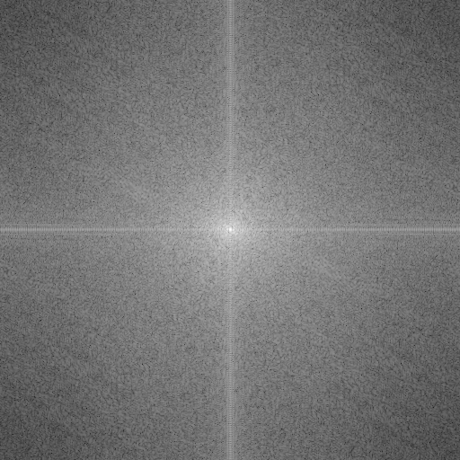|
--|--|--|--
D0|= 50||
理想|||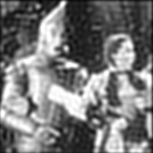
1阶巴特沃斯||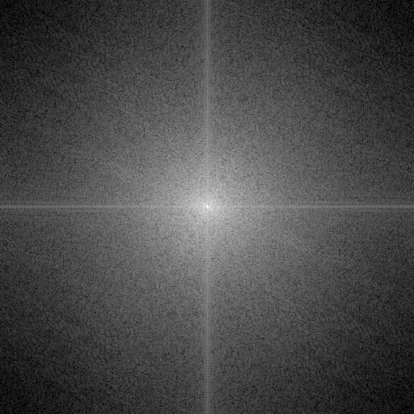|
2阶巴特沃斯|||
3阶巴特沃斯||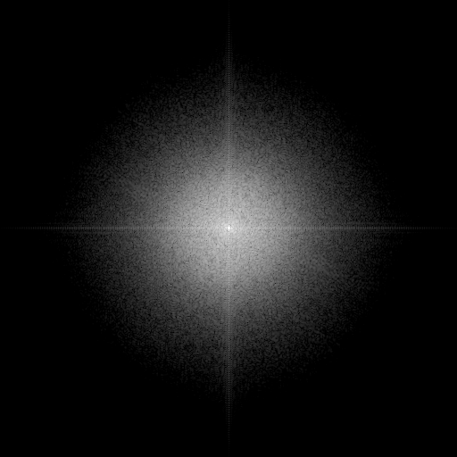|
高斯||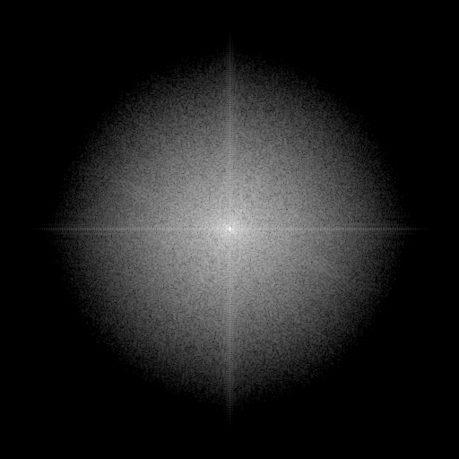|
D0|= 20||
理想||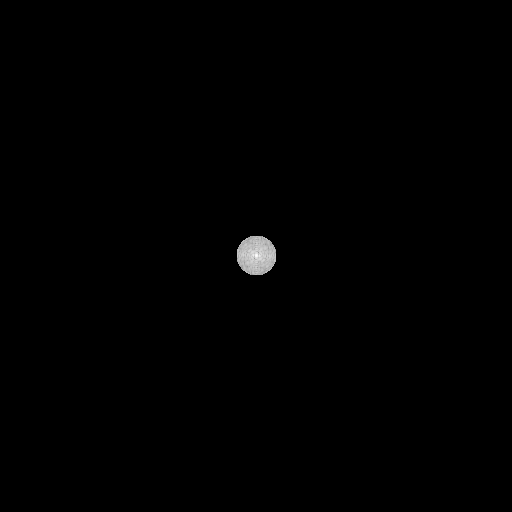|
1阶巴特沃斯||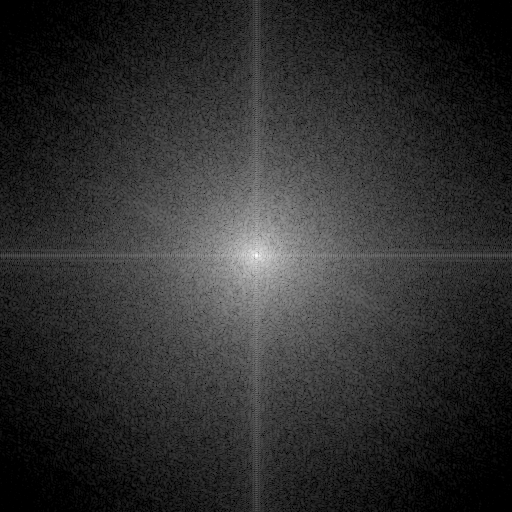|
2阶巴特沃斯||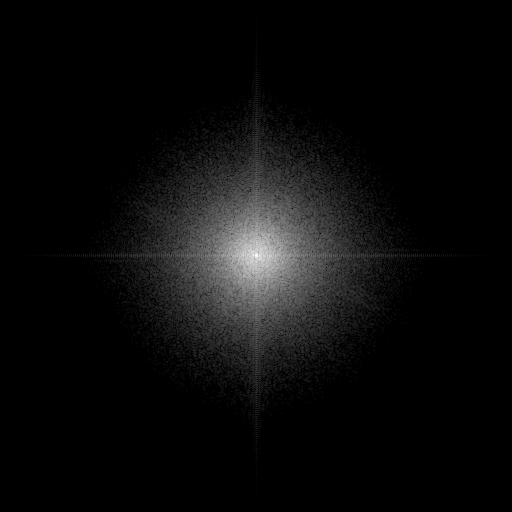|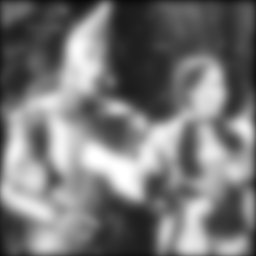
3阶巴特沃斯|||
高斯|||

低通滤波器|test2|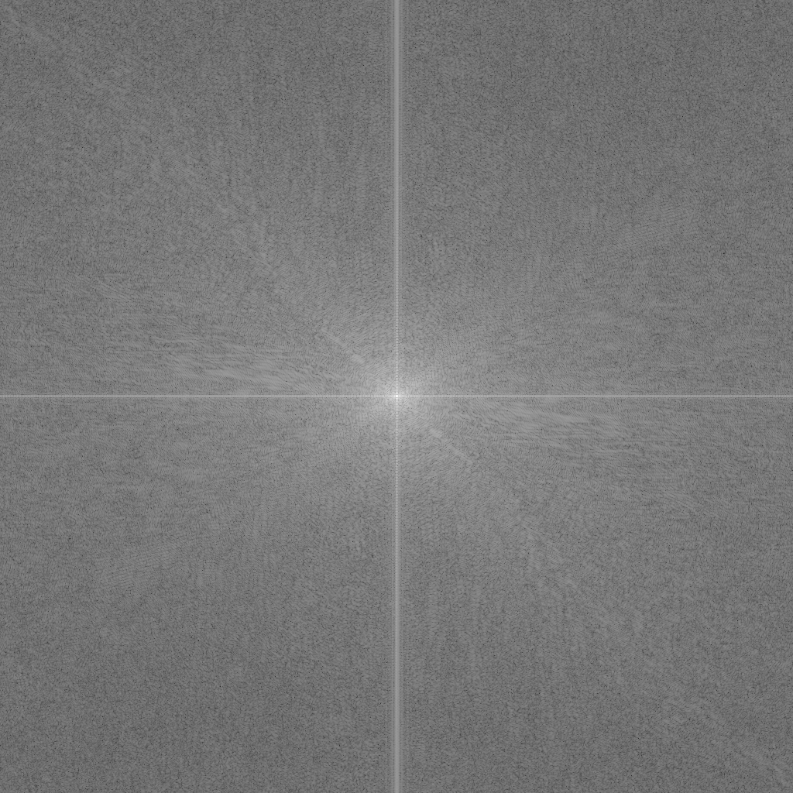|
--|--|--|--
D0|= 50||
理想|||
1阶巴特沃斯||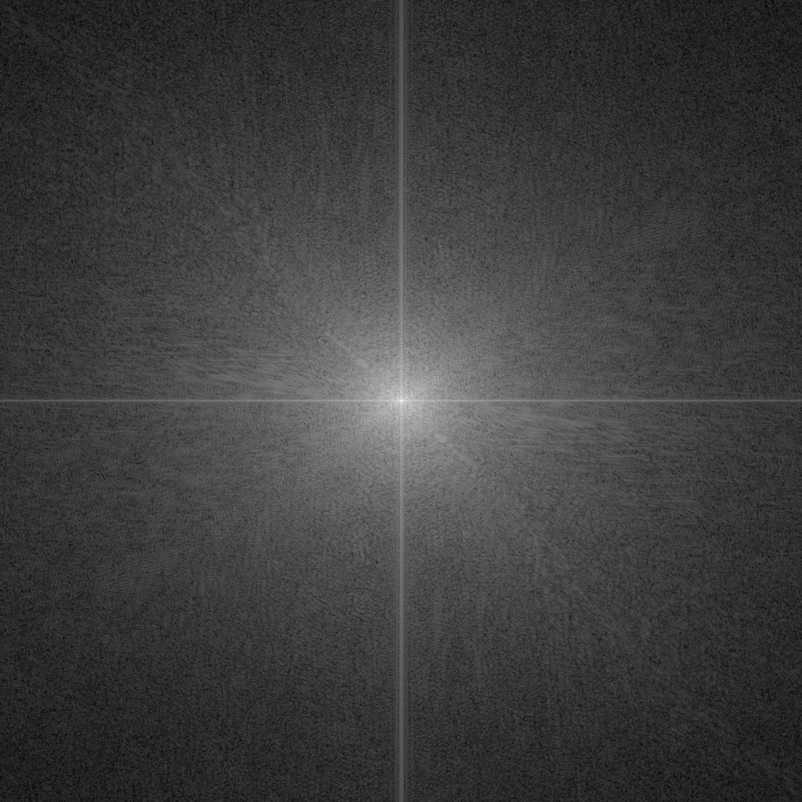|
2阶巴特沃斯||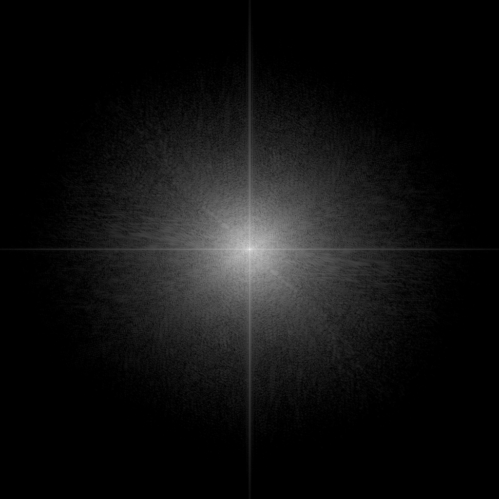|
3阶巴特沃斯|||
高斯|||
D0|= 20||
理想|||
1阶巴特沃斯||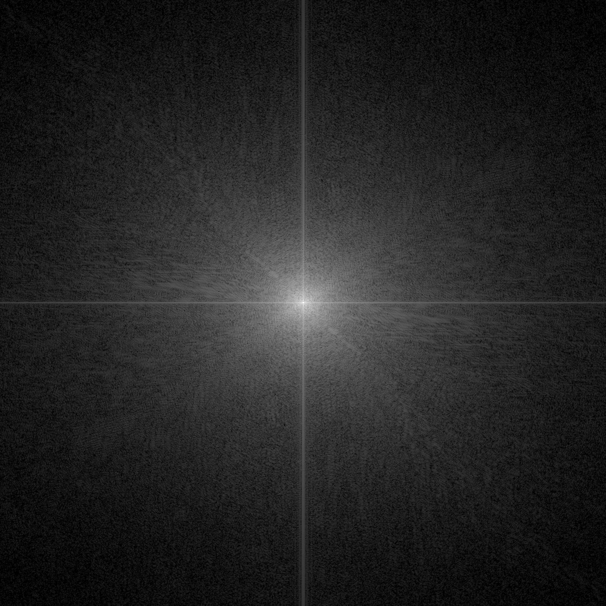|
2阶巴特沃斯|||
3阶巴特沃斯|||
高斯||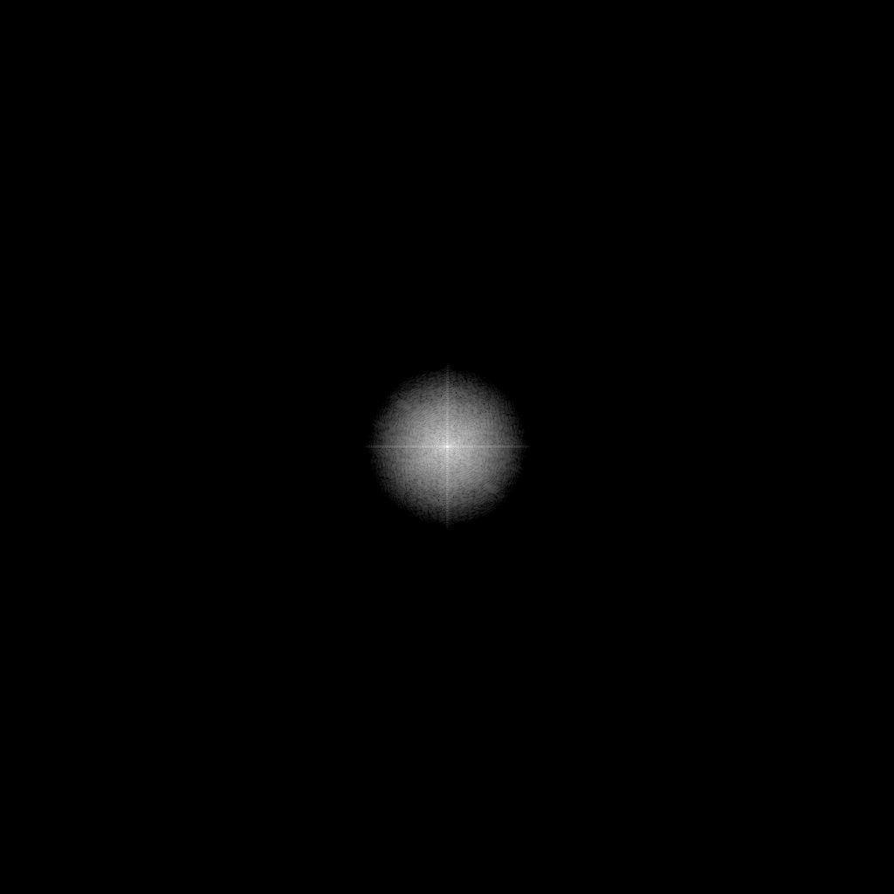|

* 

---

## 题目2

> 