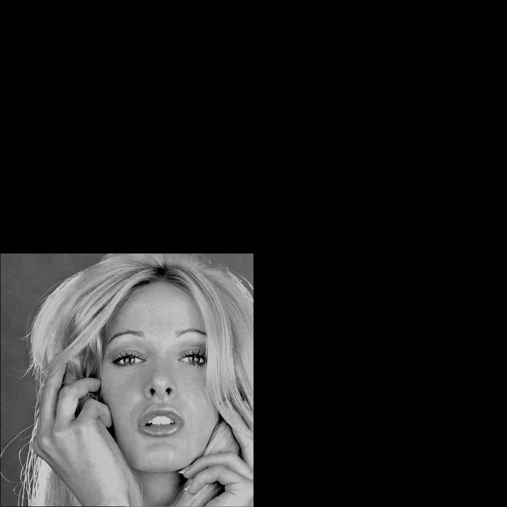
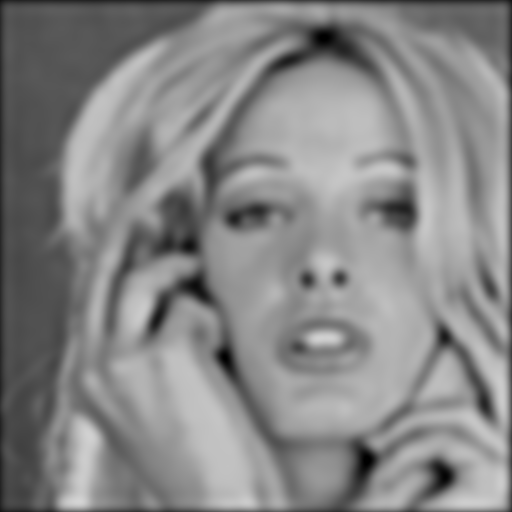
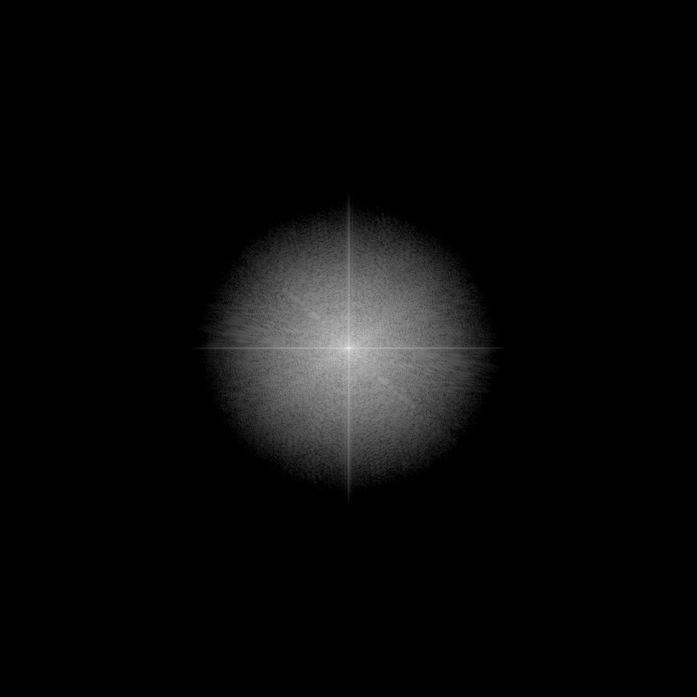
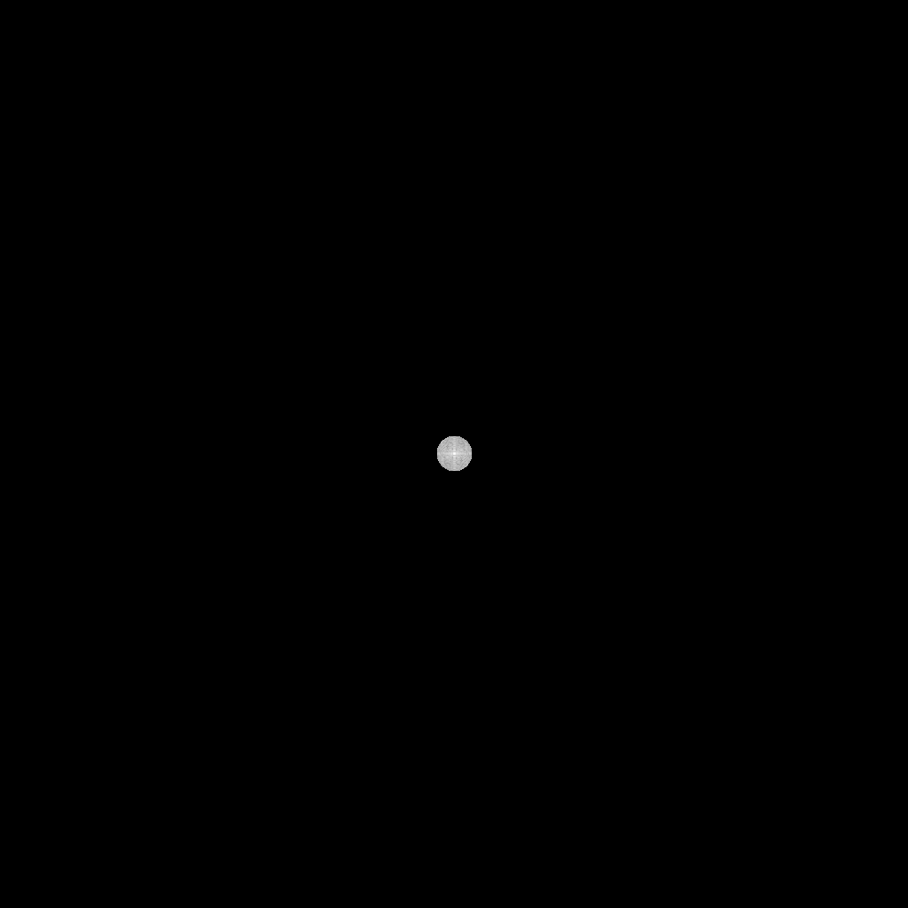
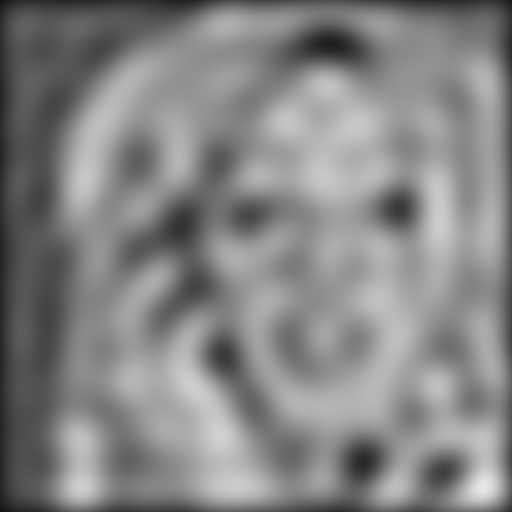
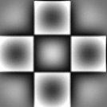
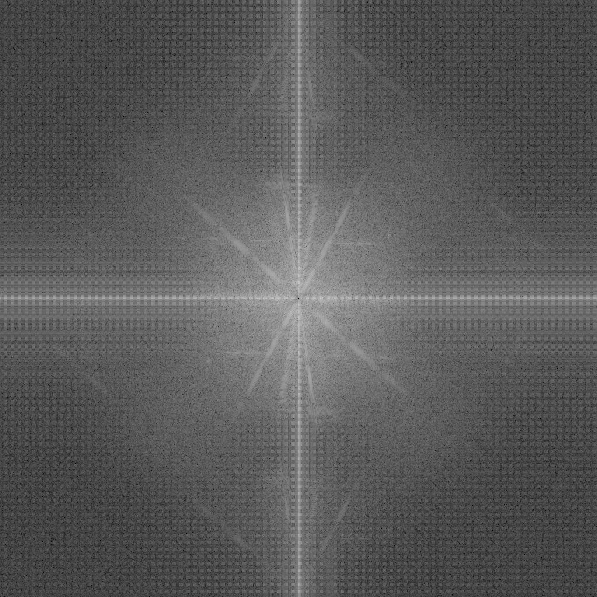
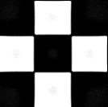

# 第五次作业

### 自动化少61 何奈特 2140506114

注：由于github上无法正常显示markdown公式，只好转成图片

---

## 题目1

> 频域低通滤波器：设计低通滤波器包括 butterworth and Gaussian，选择合适的半径，计算功率谱比，平滑测试图像test1和2

* 对位图格式pgm和tif，沿用上次的处理，详见[bitmap.cpp](bitmap.cpp)（注：上次作业中的PGM5类存在一个bug，读入的长的宽顺序反了，碰巧后面又误把宽写作高，对矩形图像test3.pgm会出现一行瑕疵，现已修复）。此外将一些常用文件名操作（例如添加后缀）加入了Bitmap类中，另改变了bmp的写文件操作，可以更方便地输出中心搬移过的频谱图。

* 读入一幅M*N的图像后，至少要补零至2M*2N，这是为了避免wraparound错误；另外为了方便实现FFT算法，需要补到2的整数次幂，综上输入图像应该补零至P*P，P=2^(ceil(lb(max(M, N))))。对此进行二维DFT得到复频谱，与滤波器的频谱逐点相乘，再进行逆DFT（就是对频谱再进行一次DFT，做中心对称，然后逐点除以P^2），依原图范围裁剪得到处理后图像。详见[filter.cpp](filter.cpp)

* 这里使用最简单的方式计算二维DFT：先对每一行计算FFT，再对每一列计算FFT，复杂度n*n*log(n)，对于大图像的处理稍慢，这点不可避免。代码见[fft.cpp](fft.cpp)

* 功率谱定义为圆内频点模平方的求和，这部分内容写在[ps.cpp](ps.cpp)中，生成了几幅功率谱分布图（横轴是频率，纵轴是功率谱密度），以及功率谱比表[test1_ps.csv](test1_ps.csv)、[test2_ps.csv](test2_ps.csv)、[test3_ps.csv](test3_ps.csv)、[test4_ps.csv](test4_ps.csv)：

图像|功率谱图
--|--
|
|
|
|

功率谱比|test1|test2|test3|test4
--|--|--|--|--
10|0.880412|0.926615|0.842839|0.905507
20|0.940086|0.957706|0.922725|0.948356
25|0.954613|0.965337|0.932647|0.959681
50|0.980629|0.981445|0.978356|0.982474
100|0.993942|0.989779|0.996205|0.993447

* butterworth的公式为 

* Gaussian的公式为 

* [main.cpp](main.cpp)中规定了所有的滤波器，在main函数中读入文件，逐个调用filter函数进行处理。第一题取D0=20、50（巴特沃斯分别取1、2、3阶），结果如下：

test1|低通D0=50||
--|--|--|--
理想|||
1阶巴特沃斯|||
2阶巴特沃斯|||
3阶巴特沃斯|||
高斯|||

test1|低通D0=20||
--|--|--|--
理想|||
1阶巴特沃斯|||
2阶巴特沃斯|||
3阶巴特沃斯|||
高斯|||

test2|低通D0=50||
--|--|--|--
理想|||
1阶巴特沃斯|||
2阶巴特沃斯|||
3阶巴特沃斯|||
高斯|||

test2|低通D0=20||
--|--|--|--
理想|||
1阶巴特沃斯|||
2阶巴特沃斯|||
3阶巴特沃斯|||
高斯|||

* 可见滤波器半径越小，图像的高频区越弱，模糊效果越明显。巴特沃斯阶次越高（极限->理想滤波器），模糊效果也更强，而且会出现ringing环效应。

---

## 题目2&3

> 频域高通滤波器：设计高通滤波器包括butterworth,Gaussian,拉普拉斯和Unmask，测试图像test3,4

* 高通butterworth和Gaussian就是1-低通：$ \frac {1}{1+(d_0/d)^{2n}} $ 和 $ 1-e^{-\frac {d^2}{2d_0^2}} $

* 上次作业做过空域的拉普拉斯，对这个模板（0,-1,0|-1,4,-1|0,-1,0)进行二维DFT可得：

$$ 4-e^{j2{\pi}\frac uN}-e^{j2{\pi}\frac vN}-e^{-j2{\pi}\frac uN}-e^{-j2{\pi}\frac uN} $$

$$ =2(1-\cos(2{\pi}\frac uN))+2(1-\cos(2{\pi}\frac vN)) $$

将cos函数展开成幂级数，保留二阶项（鉴于$ 2\pi\frac uN $取值在$ [-\pi,\pi] $之间，高频能量比较小，这样的近似还算合理），得：

$$ =2(1-1+\frac{(2{\pi}\frac uN)^2}2)+2(1-1+\frac{(2{\pi}\frac vN)^2}2) $$

$$ =4\pi^2(\frac{u^2}{N^2}+\frac{v^2}{N^2}) = \frac {4\pi^2}{N^2}d^2 $$

对于带对角线项的拉普拉斯模板，同理：

$$ 8-e^{j2{\pi}\frac uN}-e^{j2{\pi}\frac vN}-e^{-j2{\pi}\frac uN}-e^{-j2{\pi}\frac uN}-e^{j2{\pi}\frac {u+v}N}-e^{j2{\pi}\frac {u-v}N}-e^{-j2{\pi}\frac {u+v}N}-e^{-j2{\pi}\frac {u-v}N} $$

$$ =2(1-\cos(2{\pi}\frac uN))+2(1-\cos(2{\pi}\frac vN))+2(1-\cos(2{\pi}\frac {u+v}N))+2(1-\cos(2{\pi}\frac {u-v}N)) $$

$$ =2(1-1+\frac{(2{\pi}\frac uN)^2}2)+2(1-1+\frac{(2{\pi}\frac vN)^2}2) $$

$$ =\frac {4\pi^2}{N^2}(u^2+v^2+(u+v)^2+(u-v)^2) = =\frac {12\pi^2}{N^2}d^2 $$

* 下面是高通滤波的结果，由于算出的值有正有负（零频分量/直流偏置被去除），这里给每个像素灰度值统一加上了128：（代码见[p2.cpp](p2.cpp)）

test3|高通D0=10||
--|--|--|--
理想|||
1阶巴特沃斯|||
2阶巴特沃斯|||
3阶巴特沃斯|||
高斯|||

test3|高通D0=25||
--|--|--|--
理想|||
1阶巴特沃斯|||
2阶巴特沃斯|||
3阶巴特沃斯|||
高斯|||

test3|拉普拉斯||
--|--|--|--
4向|||
8向|||

test4|高通D0=10||
--|--|--|--
理想|||
1阶巴特沃斯|||
2阶巴特沃斯|||
3阶巴特沃斯|||
高斯|||

test4|高通D0=25||
--|--|--|--
理想|||
1阶巴特沃斯|||
2阶巴特沃斯|||
3阶巴特沃斯|||
高斯|||

test4|拉普拉斯||
--|--|--|--
4向|||
8向|||

* 高通滤波相当于提取了图像的边缘，unmask就是在原图上叠加高通滤波的结果，结果相当于对原图取锐化。空域上加上原图，在频域看就是滤波器频谱每点值加一，详见[main.cpp](main.cpp)中名字前带'm'的滤波器函数。结果如下：

test3|
--|--
理想D0=10|
1阶巴D0=10|
2阶巴D0=10|
3阶巴D0=10|
高斯D0=10|
理想D0=25|
1阶巴D0=25|
2阶巴D0=25|
3阶巴D0=25|
高斯D0=25|
4向拉|
8向拉|

test4|
--|--
理想D0=10|
1阶巴D0=10|
2阶巴D0=10|
3阶巴D0=10|
高斯D0=10|
理想D0=25|
1阶巴D0=25|
2阶巴D0=25|
3阶巴D0=25|
高斯D0=25|
4向拉|
8向拉|
